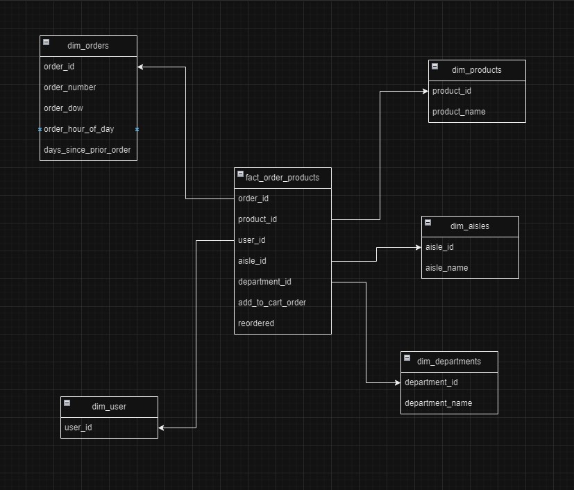
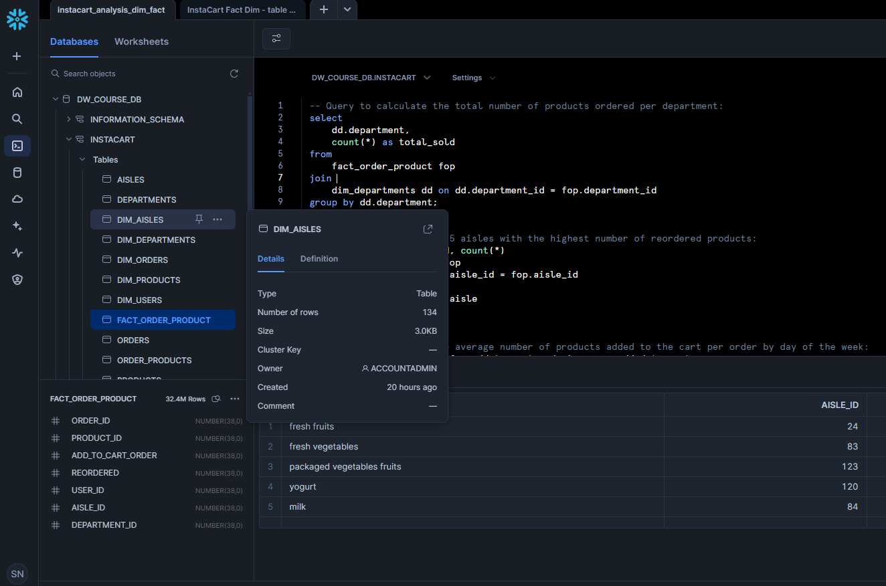

# Instacart Online Grocery Shopping Data Engineering w/Snowflake

## Overview
This project is based on data from the InstaCart Kaggle Analytics competition, involving 3 million data points split across 5 CSV files. The primary objective was to leverage cloud-based solutions for data storage, processing, and analytics. Using **AWS S3** and **Snowflake**, the project demonstrates the creation of a data pipeline, data modeling & dim-fact modelling, and analytical insights.

## Project Goals
1. Store and manage large datasets (roughly 3 million data points) using **AWS S3**.
2. Create and authenticate a Snowflake stage connected to S3 buckets for seamless data integration.
3. Design appropriate **tables and schemas** in Snowflake.
4. Use SQL to transform the data into a **Fact-Dimension Star Schema** for analytical purposes.
5. Run various analyses to derive meaningful insights.

## Project Workflow
1. **Data Storage in S3**: Uploaded 5 CSV files to AWS S3 for centralized data storage.
2. **Snowflake Integration**:
   - Created a Snowflake stage connected to S3.
   - Authenticated and set up the Snowflake account for data access.
3. **Table Creation**:
   - Established initial tables and schemas in Snowflake.
   - Copied data from S3 buckets into Snowflake tables.
4. **Data Transformation**:
   - Designed a new schema for a **Fact-Dimension Star Schema** using SQL.
   - Populated the schema with cleaned and transformed data.
5. **Analytical Insights**: Performed various analyses on the transformed data to uncover key trends and insights.

## Key Insight
A notable discovery from the data analysis was that the **Fresh Fruits** aisle was the most reordered product category, with a total of **2,615,469** reordered items.

### Sample Query
Here's a query example used to find the top reordered products:

```sql
-- Query to find the top 5 aisles with the highest number of reordered products:
select aisle, da.aisle_id, count(*)
from fact_order_product fop
join dim_aisles da on da.aisle_id = fop.aisle_id
where reordered = True
group by da.aisle_id, da.aisle
order by count(*) desc
limit 5;
```

### Snowflake Schema Design - Dimension Modelling



## Technology Stack
- AWS S3 for cloud data storage
- Snowflake for data warehousing and SQL-based analytics
- SQL for data transformation and analysis
